# 计算机网络概述

##  什么是计算机网络

## 什么是网络协议

## 计算机网络结构

## Internet结构

## 电路交换

## 多路复用

## 报文交换和分组交换

## 计算机网络性能

## 计算机网络体系结构
 

#  应用层

## 网络应用的体系结构

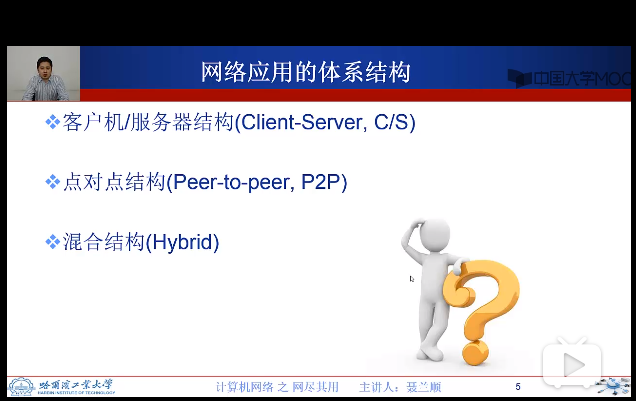

### 客户机/服务器

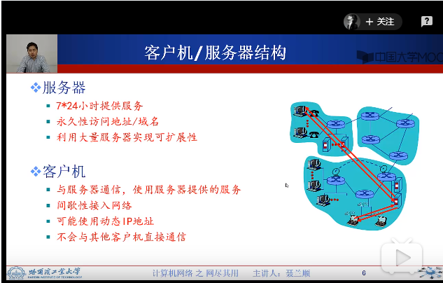

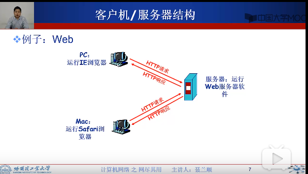

### P2P

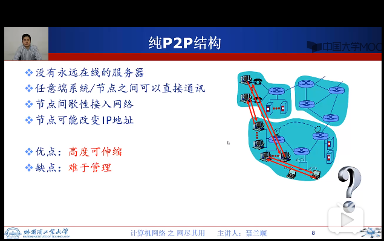

## 网络应用进程通信

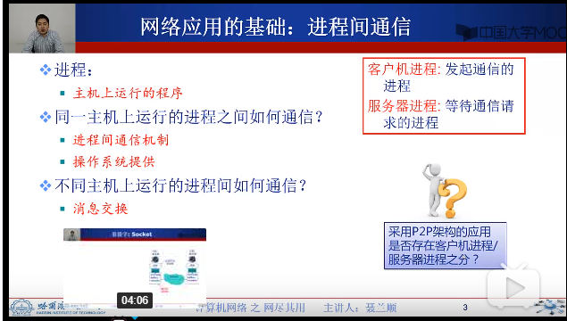

Answer: 有

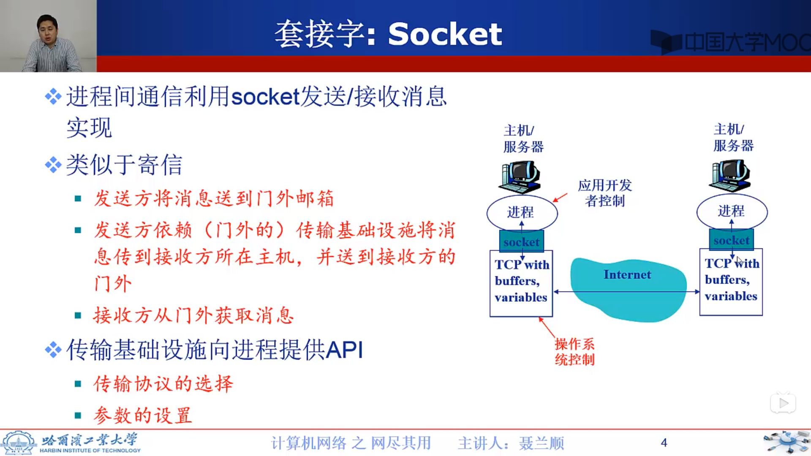

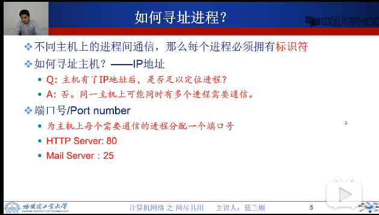

## 应用层协议

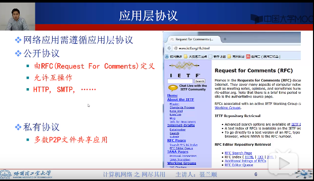

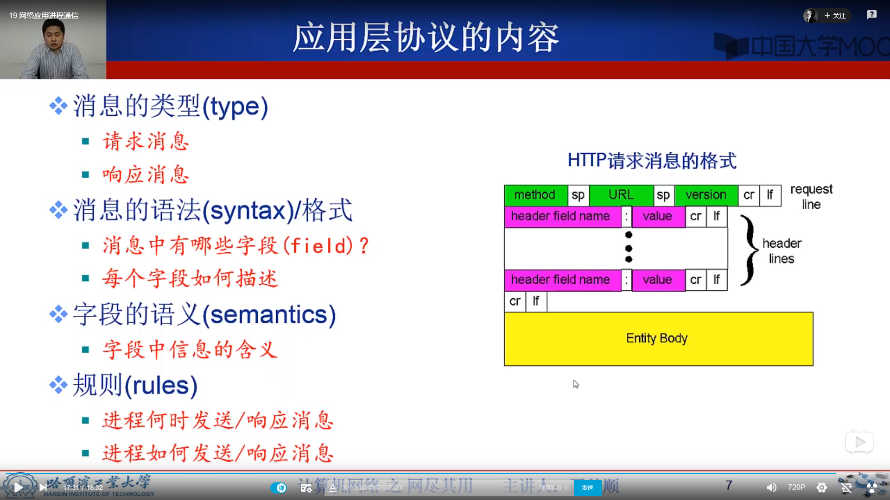

## 网络应用需求

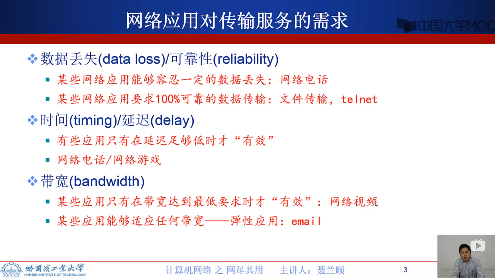

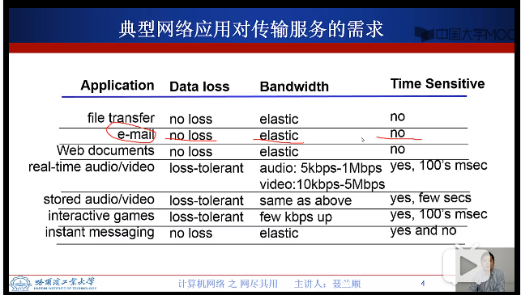

## Internet提供的传输服务

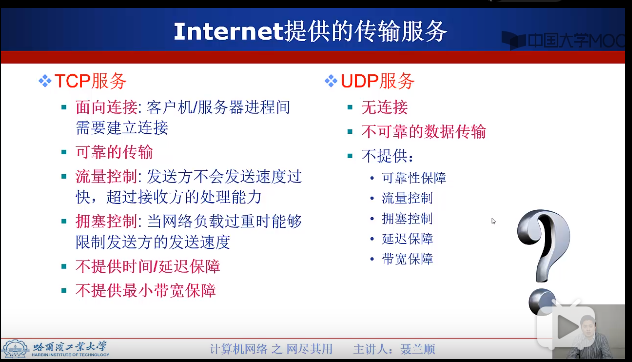

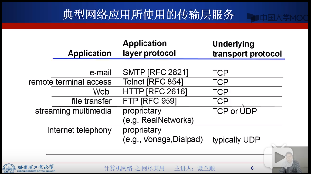

## WEB应用概述

 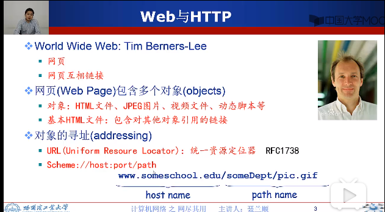
 
 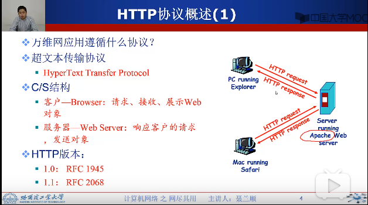
 
 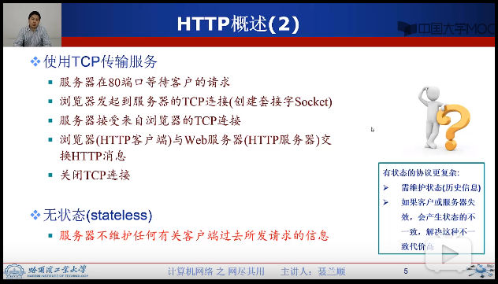
 

## HTTP连接类型

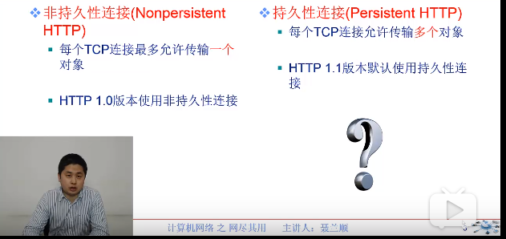

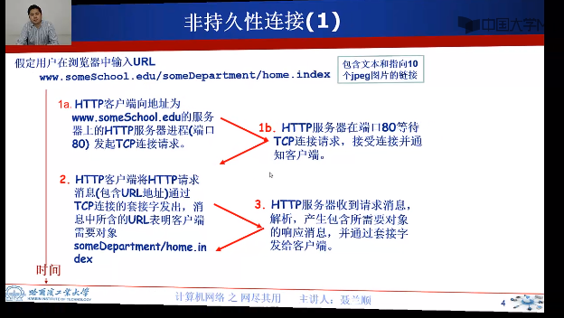

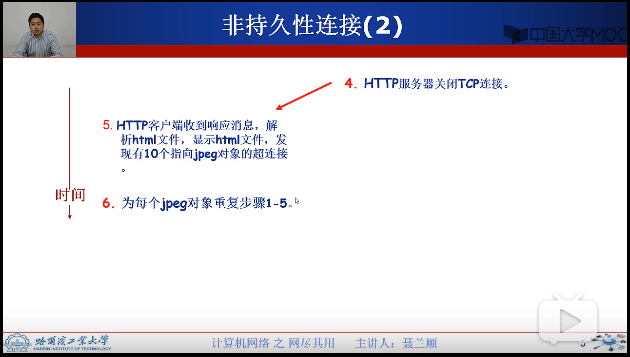

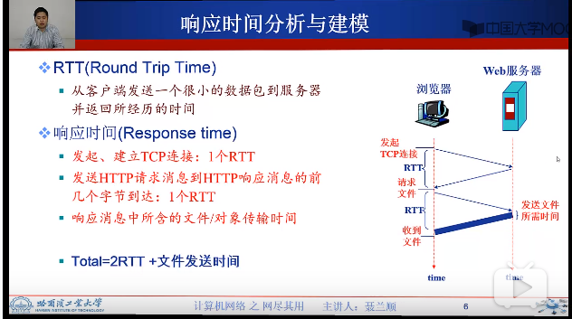

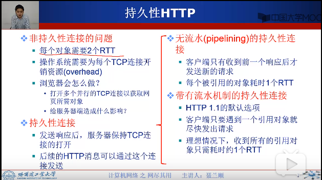

## HTTP消息格式

 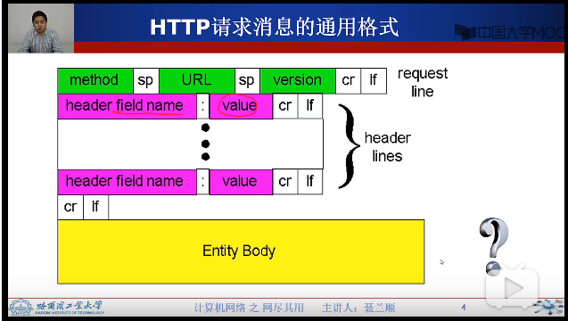
 
 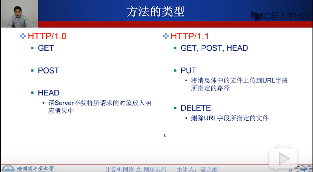
 
 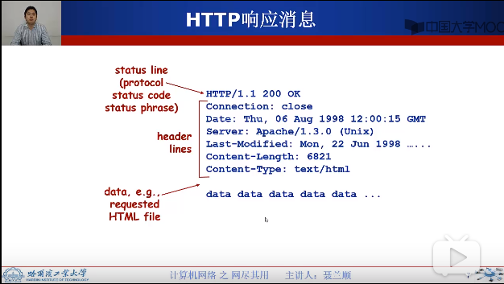
 
 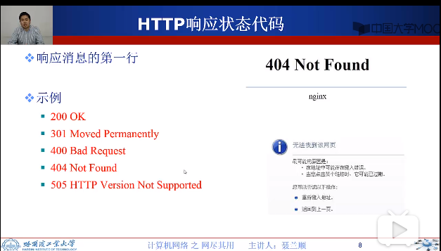