# 计算机网络概述

##  什么是计算机网络

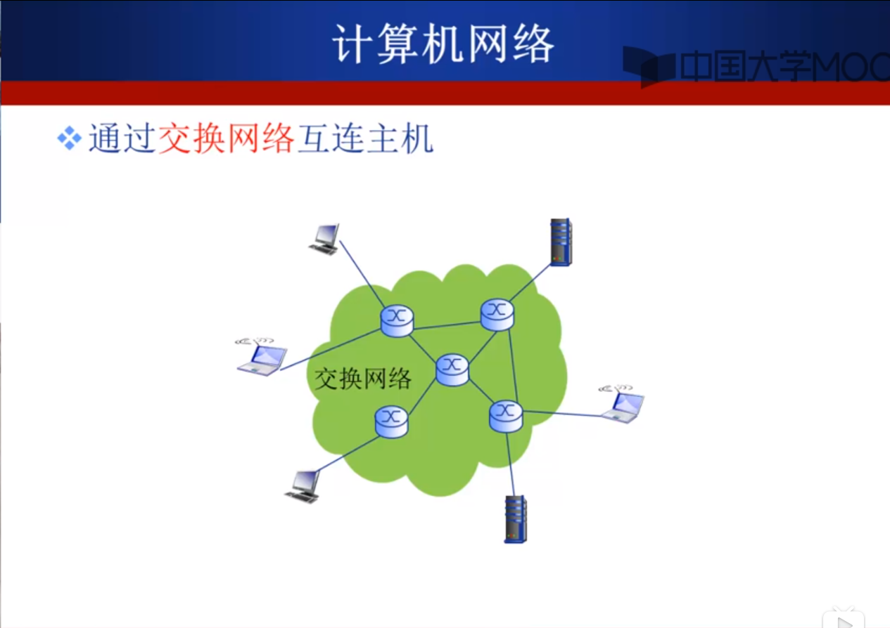

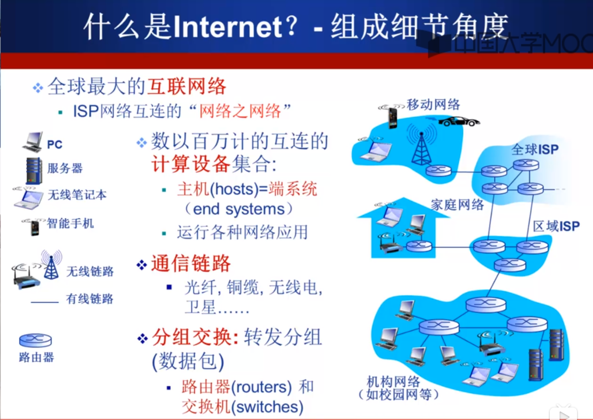

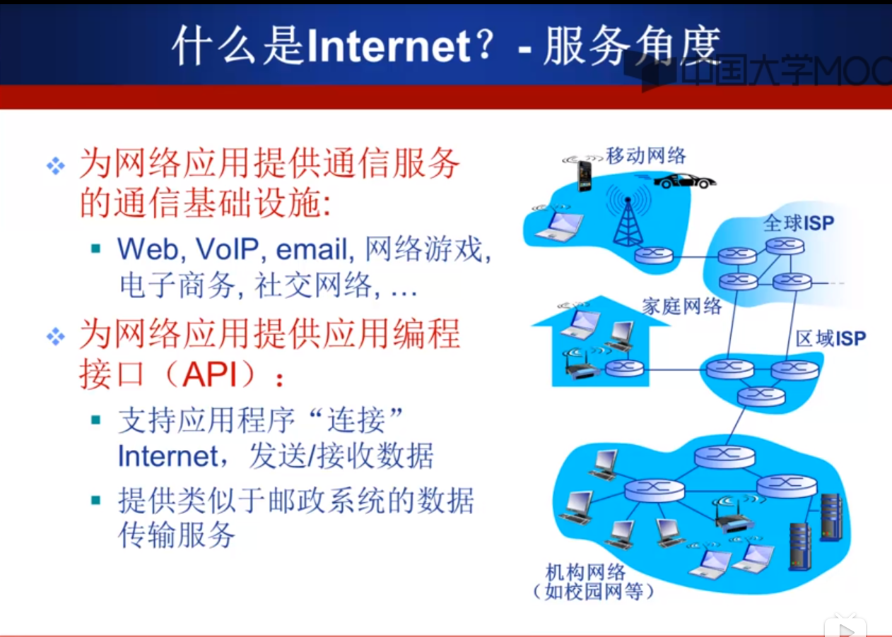

## 什么是网络协议

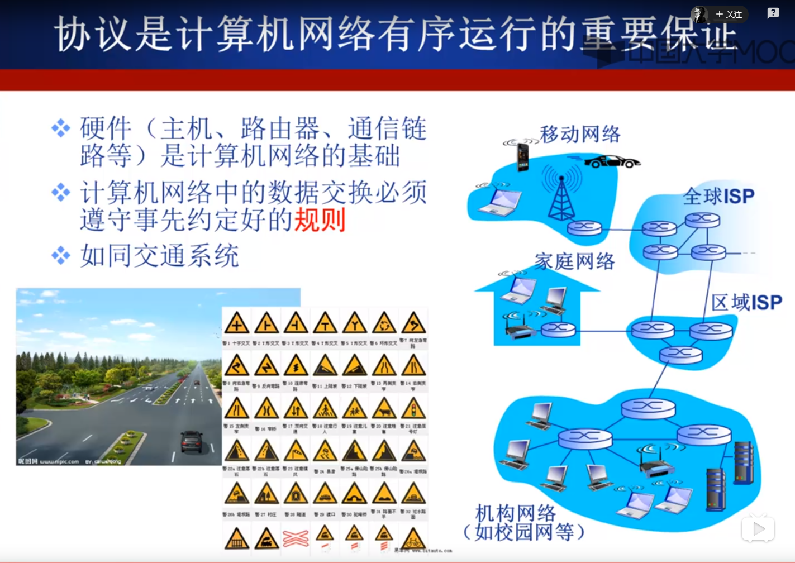
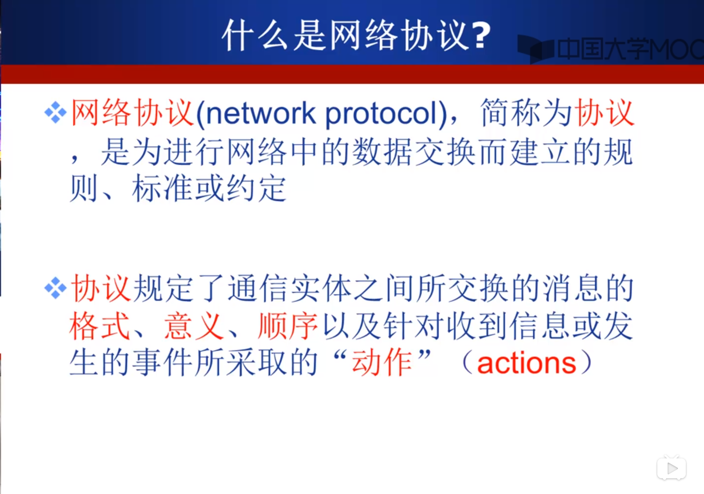
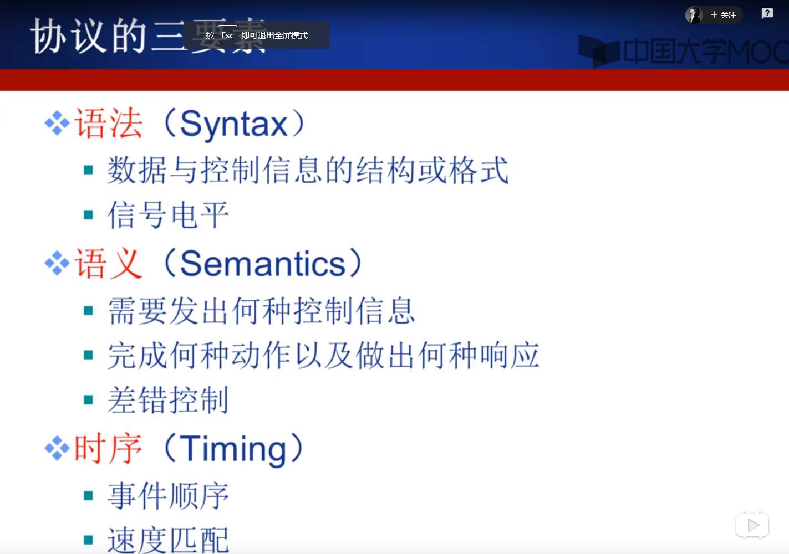

## 计算机网络结构

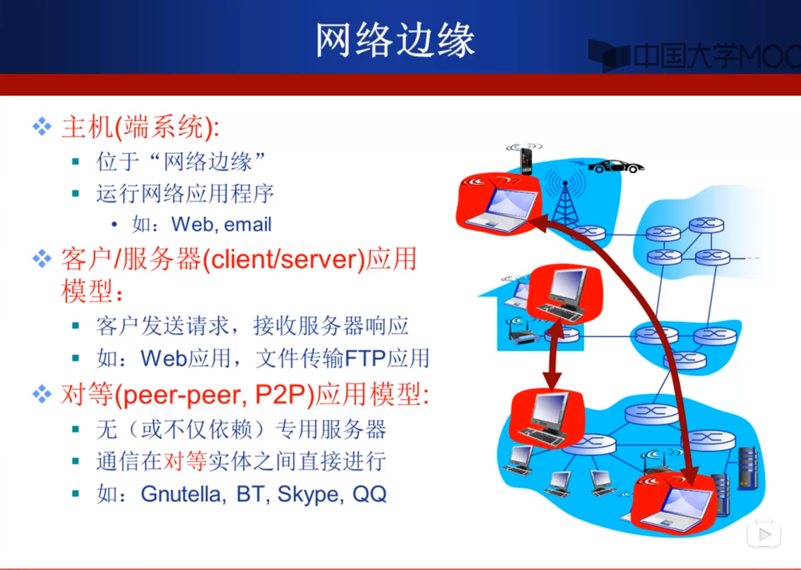

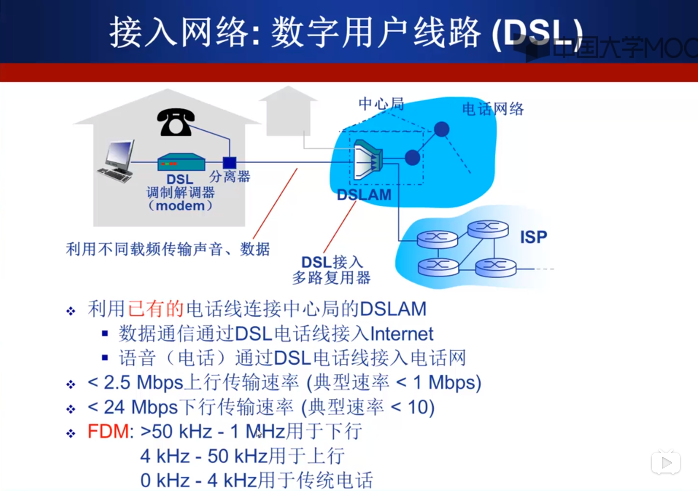

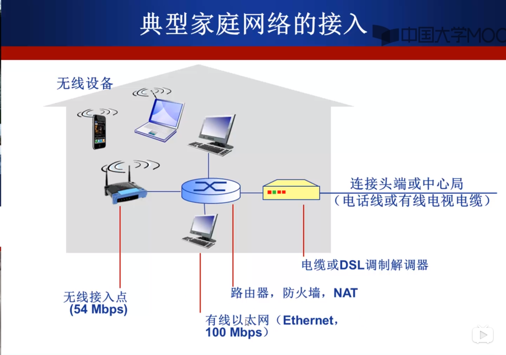

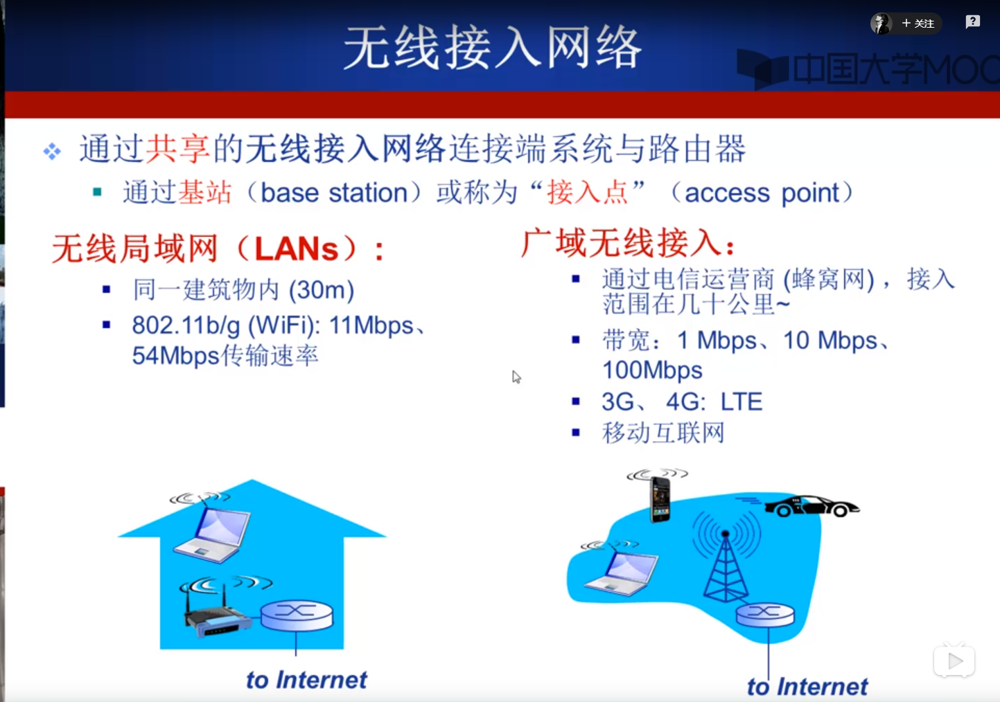

## Internet结构

## 电路交换

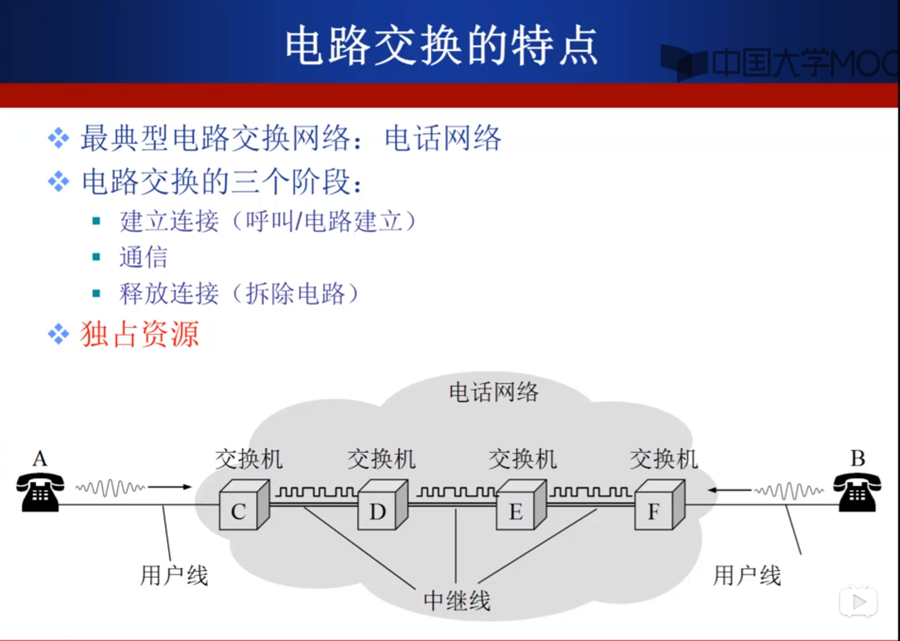

## 多路复用

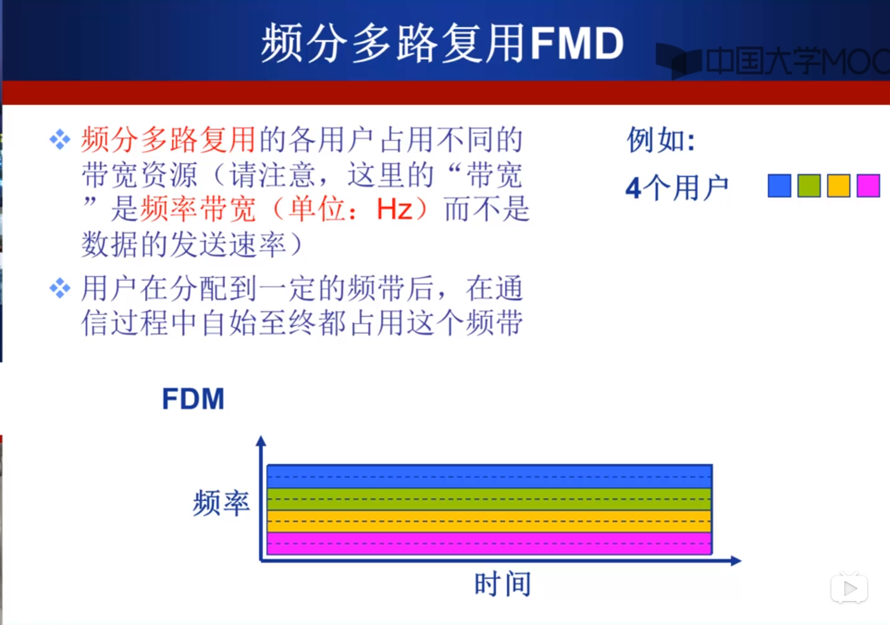

## 报文交换和分组交换

## 计算机网络性能

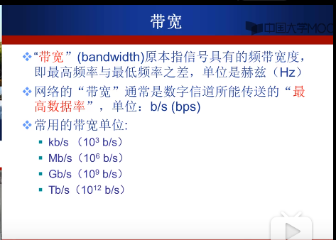

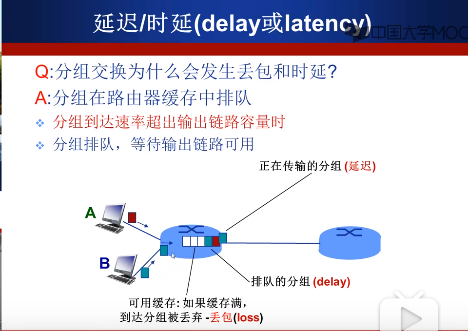

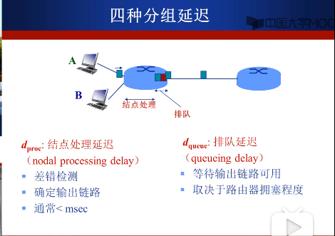

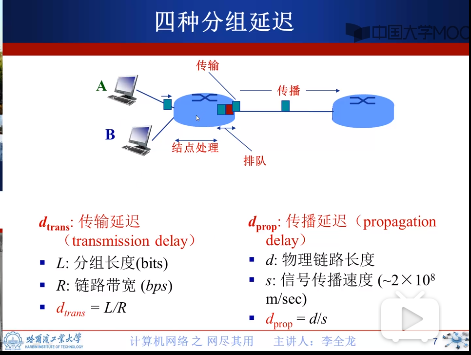

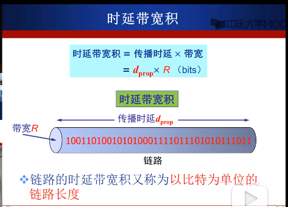

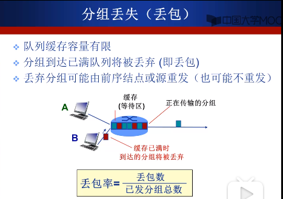

## 计算机网络体系结构
 

#  应用层

## 网络应用的体系结构

### 客户机/服务器

### P2P

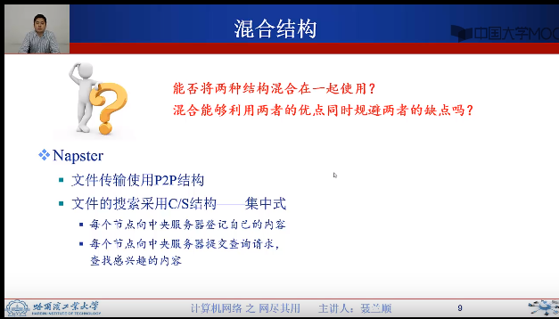

## 网络应用进程通信

Answer: 有

## 应用层协议

## 网络应用需求

## Internet提供的传输服务

## WEB应用概述

 
 
 
 
 
 

## HTTP连接类型

## HTTP消息格式

 
 
 
 
 
 
 